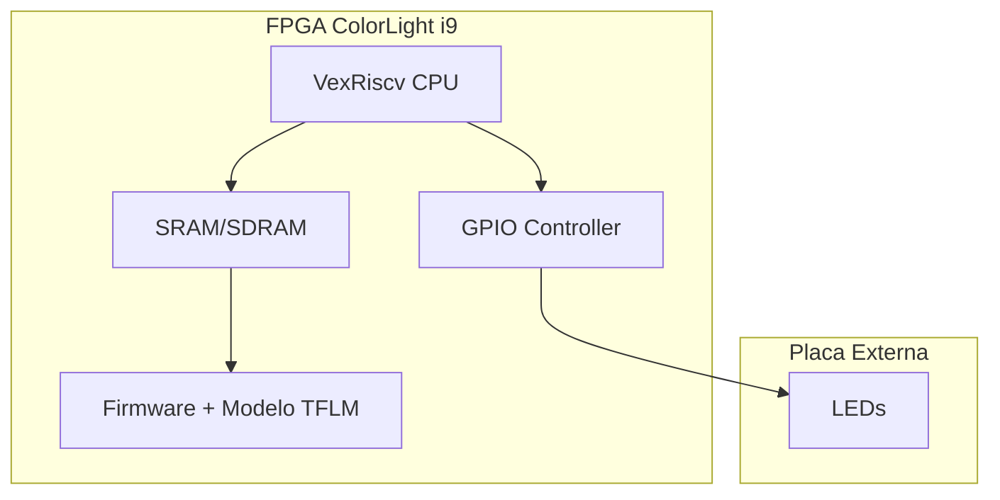

# TensorFlow Lite Micro em SoC LiteX

Nesta tarefa eu implementei um sistema capaz de rodar inferência TinyML usando um processador softcore VexRiscv dentro de uma FPGA ColorLight i9. A ideia foi usar o modelo Hello World do TensorFlow Lite Micro, aquele que aproxima uma função seno, e aproveitar a saída para controlar uma barra de 8 LEDs, criando um efeito visual proporcional ao valor previsto pela rede neural.

## Visão Geral do Sistema

O projeto é baseado em um SoC gerado com o LiteX, que inclui CPU, memória e periféricos de I/O. No firmware, escrito em C++, o runtime do TFLM é carregado e executa o modelo repetidamente dentro do loop principal.

### Diagrama de Blocos

### Hardware Utilizado

Placa FPGA: ColorLight i9 
Interface: Placa de extensão com uma barra de 8 LEDs ligada ao header J1

### Pinagem
| Bit (Firmware) | Pino FPGA | Pino CN2 | 
| -------------- | --------- | -------- | 
| LED 0 (LSB)    | P17       | 4        | 
| LED 1          | P18       | 6        | 
| LED 2          | N18       | 8        | 
| LED 3          | L20       | 10       | 
| LED 4          | L18       | 12       | 
| LED 5          | G20       | 14       | 
| LED 6          | M18       | 11       | 
| LED 7 (MSB)    | N17       | 9        | 

### Estrutura do Projeto
```text
tflm_litex/
├── firmware/               # Código-fonte do firmware
│   ├── tflm/               # Biblioteca TensorFlow Lite Micro 
│   ├── linker.ld           # Script de linker do VexRiscv
│   ├── main.cc             # Loop de inferência + controle dos LEDs
│   ├── models/             # Modelo quantizado convertido para array C
│   ├──     ├── hello_world_int8_model_data.cc
│   ├──     └── hello_world_int8_model_data.h
│   ├── hello_world_tflm_litex.ipynb   # Notebook de treino e conversão do modelo
│   └── Makefile            # Script de compilação do firmware
├── litex/                  # Geração do gateware (SoC LiteX)
│   └── colorlight_i5.py    # Script de configuração do SoC/VexRiscv e periféricos
README.md                   # Documentação do projeto

```

## Compilação e execução

### 1. Gerar o Bitstream
Entrar no ambiente do OSS-CAD-Suite:
```bash
source ~/caminho/para/o/oss-cad-suite/environment
```
Depois gerar o hardware:
```bash
cd litex
python3 colorlight_i5.py --board i9 --revision 7.2 --build --cpu-type=vexriscv --ecppack-compress
```

### 2. Compilar o Firmware
```bash
cd ../firmware
make
```

A biblioteca libtflm.a já está no repositório

### 3. Carregar o Gateware e o Firmware

```bash
cd ..

openFPGALoader -b colorlight-i5 build/colorlight_i5/gateware/colorlight_i5.bit

litex_term /dev/ttyACM0 --speed 115200 --kernel firmware/build/main.bin
```
