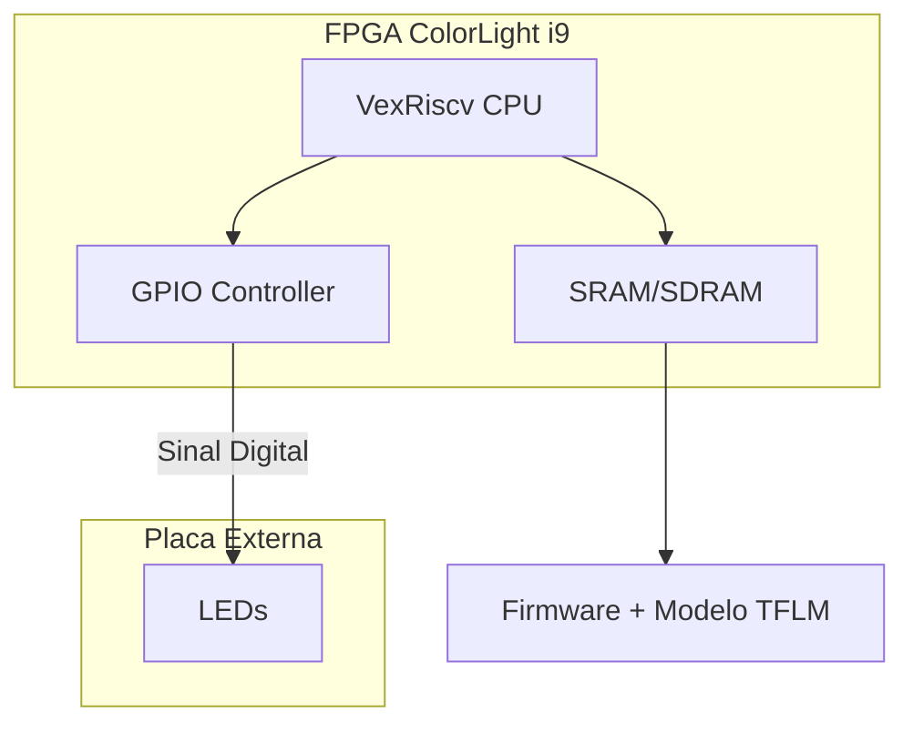

# TensorFlow Lite Micro em SoC LiteX

Nesta tarefa eu implementei um sistema capaz de rodar inferência TinyML usando um processador softcore VexRiscv dentro de uma FPGA ColorLight i9. A ideia foi usar o modelo Hello World do TensorFlow Lite Micro, aquele que aproxima uma função seno, e aproveitar a saída para controlar uma barra de 8 LEDs, criando um efeito visual proporcional ao valor previsto pela rede neural.

## Visão Geral do Sistema

O projeto é baseado em um SoC gerado com o LiteX, que inclui CPU, memória e periféricos de I/O. No firmware, escrito em C++, eu carrego o runtime do TFLM e executo o modelo repetidamente dentro do loop principal.

### Diagrama de Blocos

### Hardware Utilizado

Placa FPGA: ColorLight i9 
Interface: Placa de extensão com uma barra de 8 LEDs ligada ao header J1

### Pinagem
| Bit (Firmware) | Pino FPGA | Pino CN2 | 
| -------------- | --------- | -------- | 
| LED 0 (LSB)    | P17       | 4        | 
| LED 1          | P18       | 6        | 
| LED 2          | N18       | 8        | 
| LED 3          | L20       | 10       | 
| LED 4          | L18       | 12       | 
| LED 5          | G20       | 14       | 
| LED 6          | M18       | 11       | 
| LED 7 (MSB)    | N17       | 9        | 
